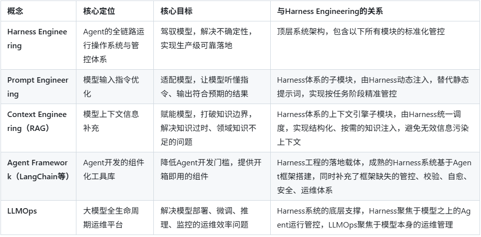

# Harness Engineering 技术文档

Harness Engineering 是2026年正式成型并引爆AI工程界的新一代核心范式，是大模型从「对话玩具」走向「工业化生产力工具」的关键支撑，彻底解决了大模型/AI Agent 不可控、不可靠、无法规模化落地生产的核心痛点。

## 目录

- [一、概念起源与行业共识](#一概念起源与行业共识)
  - [1. 术语诞生与关键里程碑](#1-术语诞生与关键里程碑)
  - [2. 权威核心定义](#2-权威核心定义)
- [二、解决的核心痛点：大模型生产落地的核心瓶颈](#二解决的核心痛点大模型生产落地的核心瓶颈)
- [三、核心架构与标准模块](#三核心架构与标准模块)
  - [1. 执行循环与编排引擎（核心调度中枢）](#1-执行循环与编排引擎核心调度中枢)
  - [2. 状态与记忆管理引擎（持久化地基）](#2-状态与记忆管理引擎持久化地基)
  - [3. 工具与权限管控模块（能力封装与边界管控）](#3-工具与权限管控模块能力封装与边界管控)
  - [4. 安全护栏与校验引擎（事前拦截+事中管控）](#4-安全护栏与校验引擎事前拦截事中管控)
  - [5. 环境隔离与沙箱系统（安全执行底座）](#5-环境隔离与沙箱系统安全执行底座)
  - [6. 反馈与自愈引擎（可靠性持续提升的核心）](#6-反馈与自愈引擎可靠性持续提升的核心)
  - [7. 可观测与运维平台](#7-可观测与运维平台)
- [四、与相关核心概念的本质区别](#四与相关核心概念的本质区别)
- [五、核心设计原则](#五核心设计原则)
- [六、行业落地实践与开源生态](#六行业落地实践与开源生态)
- [七、Harness Engineer 岗位核心能力要求](#七harness-engineer-岗位核心能力要求)
- [八、当前挑战与未来趋势](#八当前挑战与未来趋势)
- [九、参考资料](#九参考资料)

## 一、概念起源与行业共识

### 1. 术语诞生与关键里程碑

Harness Engineering 并非凭空出现，而是AI工程化从单点调优走向系统设计的必然产物，其概念成型有两个核心源头：

- **术语首创**：2026年2月5日，HashiCorp联合创始人、Terraform之父Mitchell Hashimoto在技术博客中首次正式命名 Harness Engineering，核心理念为「每当Agent犯错，就工程化一套解决方案，让它永远不再犯同样的错误」，核心是通过系统设计而非提示词调优解决模型的不确定性。

- **实践验证**：2026年2月11日，OpenAI发布重磅报告《Harness engineering: leveraging Codex in an agent-first world》，披露了震撼业界的实验：3人工程师团队，5个月内全程无手写一行代码，仅通过Codex Agent完成了100万行代码的产品开发、1500+PR合并，交付了可服务数百真实用户的内测产品，效率达到手动开发的10倍。

- **行业共识**：随后Martin Fowler、Thoughtworks、LangChain等业界权威快速跟进，形成了行业通用定义，其中LangChain提出的 **Agent = LLM（大脑） + Harness（操作系统）** 成为最通俗的行业共识——裸模型只能完成文本生成，只有Harness为其赋予状态管理、工具执行、约束管控、反馈闭环等能力后，才能成为可落地干活的智能体。

### 2. 权威核心定义

Harness Engineering 是为大语言模型(LLM)及AI Agent构建模型之外的全量运行管控系统的工程实践，通过工程化手段实现对AI行为的约束、校验、执行、记忆、安全管控与错误自愈，在不修改模型本身参数的前提下，将不可控、非确定的大模型，转化为可工业化部署、可重复执行、可监控运维、可审计合规的稳定生产力工具。

**通俗类比**：如果LLM是一匹爆发力极强的野马，Prompt Engineering是教它听懂指令，RAG是给它补充地图和知识，而Harness就是缰绳、马鞍、围栏和赛道系统——既能让它发挥奔跑能力，又能杜绝脱缰、跑偏、摔倒，让它稳定、持续地完成拉货、运输等生产任务，而非仅在草原上无目的奔跑。

## 二、解决的核心痛点：大模型生产落地的核心瓶颈

Harness Engineering 诞生的核心背景，是前两代AI工程范式（Prompt Engineering、Context Engineering）已触达天花板，无法解决大模型工业化落地的核心矛盾，具体痛点如下：

- **模型幻觉与逻辑错误无法根治**：仅靠提示词和知识补充，无法杜绝模型编造事实、逻辑跳步，且模型会反复犯同类错误，无法形成持续的可靠性提升。

- **长周期任务不可持续**：大模型上下文窗口有限，面对跨天、多步骤的复杂任务，极易出现失忆、半途而废、进度丢失，无法完成端到端的生产级任务。

- **执行不可控与安全风险**：模型调用工具、访问资源时极易出现越权操作、高危指令执行、数据泄露，缺乏事前拦截、事中管控、事后审计的全链路安全体系。

- **结果不可复现与不可审计**：相同输入可能出现完全不同的输出，执行过程黑盒化，无法追溯错误根源，无法满足企业级合规、风控要求。

- **规模化落地成本极高**：每个场景都需要单独调优提示词、定制RAG链路，无法形成可复用的标准化运行体系，人力成本和维护成本指数级上升。

Harness Engineering 从「调教模型」转向「设计系统」，通过工程化的闭环体系，一次性系统性解决上述所有痛点，实现AI Agent 可靠性的指数级累积提升。

## 三、核心架构与标准模块

行业内成熟的Harness系统普遍采用「分层闭环架构」，核心分为6大核心模块，形成从任务接收、执行管控、安全校验到反馈自愈的全链路闭环，是Agent的完整运行操作系统。

### 1. 执行循环与编排引擎（核心调度中枢）

这是Harness系统的大脑，负责Agent全生命周期的任务管理，彻底解决大模型长任务中断、逻辑跑偏的问题。

**核心执行范式**：标准化实现 Plan-Act-Observe-Reflect（规划-执行-观察-反思） 闭环（也叫Ralph循环/ReAct循环），强制模型每一步执行都经过「规划-验证-修正」的流程，杜绝跳步和幻觉。

**核心能力**：
- 任务自动拆解：将复杂目标拆解为可执行、可验证的原子步骤，生成标准化执行计划，写入持久化存储；
- 生命周期调度：支持任务断点续跑、超时重试、异常回滚、终止条件判断，哪怕模型重启、上下文重置，也能基于进度记录继续完成任务；
- 多Agent编排：支持Manager-Workers架构的多智能体分工，实现任务分发、角色隔离、结果汇总、交叉评审，适配复杂团队协作场景；
- 完成度校验：通过钩子机制拦截模型的「完成」信号，在干净的上下文窗口中重新注入原始目标，强制校验任务完成度，杜绝AI摆烂、提前终止任务。

### 2. 状态与记忆管理引擎（持久化地基）

解决大模型上下文窗口有限、跨会话失忆、记忆污染的核心问题，是Agent实现长周期任务的基础。

**分层记忆体系**：
- 工作内存：存储当前执行步骤的实时信息、中间结果；
- 会话内存：存储单任务全流程的对话、执行、错误日志；
- 长期记忆：存储跨会话的通用规则、业务规范、历史错误库、技能模板，实现跨任务的经验复用；

**核心能力**：上下文自动压缩、冗余信息裁剪、记忆检索、版本控制（基于Git）、状态卸载与恢复，将宝贵的上下文窗口留给核心推理任务，同时确保任务进度永久可追溯。

### 3. 工具与权限管控模块（能力封装与边界管控）

赋予Agent改变现实世界的执行能力，同时严格划定操作边界，杜绝越权和高危操作。

- **标准化工具封装**：统一OpenAPI/Swagger接口规范，预置代码执行器、数据库连接器、API调用器、UI自动化控制器等通用工具，所有工具必须自带参数校验、错误返回、执行日志，供模型理解和调用；

- **全链路权限管控**：实现工具白名单、网络访问白名单、资源配额管理（CPU/内存/执行时间/Token消耗上限），严格限制Agent可操作的资源范围，支持最小权限原则，不同任务分配不同权限等级；

- **执行审计**：所有工具调用、指令执行、资源访问全流程留痕，支持操作溯源、合规审计，出现异常可快速定位根源。

### 4. 安全护栏与校验引擎（事前拦截+事中管控）

Harness系统的核心屏障，从根源上杜绝AI幻觉、违规输出、高危操作，是企业级落地的核心前提。

**多层级校验体系**：
- 前置校验：输入指令合规校验、参数合法性校验、业务规则匹配、高危操作拦截；
- 输出生成校验：格式校验、语法检测、事实一致性校验、业务规则符合性校验；
- 执行前校验：工具调用指令二次校验，杜绝删除生产数据、越权访问等高危操作；

**核心能力**：支持自定义业务规则、合规条款、架构约束，通过Lint规则、测试套件、验证脚本实现自动化校验，不符合规则的输出/指令直接拦截，并反馈修正要求，无需人工介入。

### 5. 环境隔离与沙箱系统（安全执行底座）

防止Agent的错误操作污染生产环境、破坏系统稳定性，是生产级部署的必备模块。

- **核心实现**：为每个任务/Agent实例分配独立的临时文件系统、容器或虚拟机，实现执行环境完全隔离；

- **核心能力**：网络访问白名单限制、资源配额管控、执行超时自动终止、环境自动重置，哪怕Agent执行出现严重错误，也不会影响生产系统，同时支持错误场景复现与调试。

### 6. 反馈与自愈引擎（可靠性持续提升的核心）

这是Harness Engineering区别于其他范式的核心模块，实现Agent错误的自动化闭环解决，达成「一次犯错、永久杜绝」的效果。

**核心工作流**：
- 错误捕获：Harness系统自动捕获模型输出错误、工具执行异常、校验不通过等全量异常信息，结构化提取错误类型、根源、场景；
- 自动反馈：将错误信息、校验规则、修正要求结构化反馈给Agent，引导其自主反思、修正输出/执行指令；
- 规则沉淀：针对高频重复错误，自动生成/更新校验规则、约束条件、测试套件，沉淀到Harness系统的规则库中；
- 持续迭代：每一次错误都转化为系统的健壮性提升，随着时间推移，Agent的可靠性实现指数级增长。

### 7. 可观测与运维平台

实现Agent运行全流程的白盒化，解决黑盒执行、不可监控、不可运维的问题。

**核心能力**：全链路Trace追踪、Token消耗与成本监控、执行成功率统计、错误告警、性能瓶颈分析，支持可视化查看Agent的每一步执行、决策依据、资源消耗，同时对接企业现有监控、运维、告警体系，实现工业化运维。

## 四、与相关核心概念的本质区别

Harness Engineering 与Prompt Engineering、Context Engineering（含RAG）、LLMOps、Agent框架是互补而非替代关系，但核心定位、解决的问题有本质区别，具体对比如下：

行业演进脉络已形成清晰的三代范式：Prompt Engineering（适配模型）→ Context Engineering（赋能模型）→ Harness Engineering（驾驭模型），三者互为基础、层层递进，共同构成大模型工业化落地的完整工程体系。

## 五、核心设计原则

- **错误零重复原则**：核心准则，每发现一次Agent错误，就工程化一套解决方案，确保同类错误永远不会重复发生，实现可靠性的持续累积。

- **确定性优先原则**：所有设计围绕降低模型的不确定性，优先通过工程化规则、校验、闭环管控实现确定性输出，而非依赖模型自身能力。

- **可观测可审计原则**：Agent的每一步决策、执行、调用都必须全链路留痕，可追溯、可审计、可复现，杜绝黑盒执行。

- **最小权限原则**：严格限制Agent的操作权限，仅为其分配完成当前任务所需的最小资源、工具、访问权限，从根源上降低安全风险。

- **自愈优先原则**：优先通过自动化反馈闭环，让Agent自主修正错误，仅在极端场景下触发人工介入，降低人工运维成本。

- **松耦合原则**：Harness系统与底层模型解耦，支持无缝替换不同厂商、不同规格的LLM，避免厂商锁定，同时支持能力组件的可插拔、可扩展。

## 六、行业落地实践与开源生态

截至2026年4月，Harness Engineering已从概念快速落地为成熟的工程体系，形成了从企业级商业方案到开源框架的完整生态，核心代表实践如下：

### 1. 国际头部厂商标杆实践

- **OpenAI Codex Harness**：行业首个生产级Harness落地案例，核心实现了代码生成全流程的自动化审查、PR交叉校验、CI/CD自动集成、Git版本管控，支撑了3人团队5个月完成百万行代码的产品开发，是Harness Engineering的事实标杆。

- **Anthropic Claude Code Harness**：被行业誉为「Harness工程做得最好的产品」，核心内置了项目级规则系统、全生命周期钩子机制、子Agent架构、上下文自动压缩、技能模板系统，实现了企业级代码开发的全流程管控，错误率比纯Prompt模式降低92%。

- **LangChain DeepAgents**：行业最主流的开源通用Harness框架，基于LangGraph构建，完全兼容LangChain生态，内置可插拔的文件系统、子Agent编排、持久化记忆、钩子机制、可观测平台，是中小团队快速落地生产级Agent的首选方案。

### 2. 国内厂商与开源生态

- **阿里云 HiClaw**：面向多智能体协同的开源Harness操作系统，采用Manager-Workers架构，支持多Agent角色独立管理、记忆隔离、模型自由替换、Token成本精细化管控，解决了单体Harness架构在企业级多场景落地的扩展性问题。

- **OpenClaw**：首个面向通用开发场景的开源Harness框架，整合了结构化上下文管理、可插拔工具链、沙箱执行环境与自动化审查流水线，为开发者提供了开箱即用的Agent驾驭基础设施，大幅降低了落地门槛。

- **DeerFlow**：国内高星开源Harness框架，主打轻量化、高确定性，内置标准化执行循环、断点续跑、安全沙箱、多模型路由，支持快速对接企业现有业务系统，适配政务、金融、制造等多个行业的合规需求。

## 七、Harness Engineer 岗位核心能力要求

随着Harness Engineering的快速普及，Harness Engineer已成为2026年AI工程领域最紧缺的岗位，核心能力要求如下：

- **核心工程能力**：扎实的后端开发能力（Go/Python/TypeScript），熟悉容器化、沙箱、CI/CD、微服务架构，具备系统设计和全链路管控能力。

- **AI工程化经验**：深入理解LLM原理、Agent执行范式、Prompt Engineering、RAG技术，具备大模型落地的工程实践经验。

- **系统思维**：核心能力是从「单次错误修复」转向「系统性问题解决」，能够通过工程化手段构建可复用的规则、校验、闭环体系，而非逐行修正AI输出。

- **业务与合规理解**：能够深入理解业务场景的核心规则、边界、合规要求，将其转化为Harness系统的可执行约束。

- **运维与可观测能力**：熟悉监控、告警、链路追踪、日志分析等运维体系，能够构建Agent全链路的可观测平台。

## 八、当前挑战与未来趋势

### 1. 当前核心挑战

- **标准化体系尚未完全成型**：行业仍处于快速发展期，不同厂商的Harness架构、接口规范不统一，跨平台迁移、组件复用难度较高。

- **多模态Harness能力不足**：当前Harness体系主要聚焦文本场景，针对图像、音频、视频等多模态Agent的管控、校验、闭环能力仍有较大缺口。

- **多智能体协同管控难度高**：大规模多Agent协同场景下，角色冲突、任务死锁、记忆污染、成本失控等问题，仍需要更成熟的Harness架构解决方案。

### 2. 未来核心趋势

- **标准化与规范化**：行业将快速形成统一的Harness架构标准、接口规范、安全合规标准，成为AI Agent落地的通用基础设施。

- **多模态Harness体系成型**：针对多模态大模型、多模态Agent的全链路管控体系将快速成熟，覆盖文生图、文生视频、多模态理解等全场景的约束、校验、闭环能力。

- **端云协同Harness架构**：面向端侧AI、端云协同Agent的轻量化Harness系统将快速发展，实现端侧执行、云端管控，适配物联网、边缘计算等场景。

- **Harness即服务（HaaS）**：将出现标准化的Harness云服务，企业无需从零搭建，可按需选择场景化的Harness模板，快速接入自有模型和业务系统，大幅降低落地门槛。

- **合规自动化Harness**：面向金融、政务、医疗等强监管行业，内置行业合规规则、数据安全管控、审计追溯体系的专用Harness系统将成为核心刚需。

## 九、参考资料

> [https://ai.codefather.cn/post/2039343973285261313#heading-12](https://ai.codefather.cn/post/2039343973285261313#heading-12) 