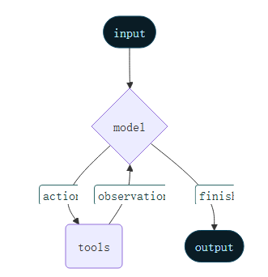

# 1. 智能体

智能体将语言模型与[工具](https://docs.langchain.com/oss/python/langchain/tools)结合起来，创建能够推理任务、决定使用哪些工具并迭代寻找解决方案的系统。



langchain使用create_agent来构建智能体，其是基于langgraph进行构建。

# 2. 核心组件

## 2.1. 模型

模型是智能体的推理引擎。

### 2.1.1. 静态模型

静态模型在创建智能体时仅配置一次，执行过程中保持不变。这是最常见且最直接的方法。我们可以先定义一个模型，然后传入给create_agent。

```python
from langchain.agents import create_agent
from langchain_openai import ChatOpenAI

model = ChatOpenAI(
    model="gpt-5",
    temperature=0.1,
    max_tokens=1000,
    timeout=30
    # ... (other params)
)
agent = create_agent(model, tools=tools)
```

### 2.1.2. 动态模型

动态模型是会在运行的过程中根据路由逻辑和成本优化动态选择模型。

```python
from langchain_openai import ChatOpenAI
from langchain.agents import create_agent
from langchain.agents.middleware import wrap_model_call, ModelRequest, ModelResponse


basic_model = ChatOpenAI(model="gpt-4o-mini")
advanced_model = ChatOpenAI(model="gpt-4o")

@wrap_model_call
def dynamic_model_selection(request: ModelRequest, handler) -> ModelResponse:
    """Choose model based on conversation complexity."""
    message_count = len(request.state["messages"])

    if message_count > 10:
        # Use an advanced model for longer conversations
        model = advanced_model
    else:
        model = basic_model

    return handler(request.override(model=model))

agent = create_agent(
    model=basic_model,  # Default model
    tools=tools,
    middleware=[dynamic_model_selection]
)
```

通过中间件中的wrap_model_call装饰器来定义。

## 2.2. 工具

### 2.2.1. 工具定义

怎么定义工具，使用openai格式来调用工具，我们在mini-agent里面已经讲过，这里不作赘述。直接看langchain是怎么定义工具的。

```python
from langchain.tools import tool
from langchain.agents import create_agent


@tool
def search(query: str) -> str:
    """Search for information."""
    return f"Results for: {query}"

@tool
def get_weather(location: str) -> str:
    """Get weather information for a location."""
    return f"Weather in {location}: Sunny, 72°F"

agent = create_agent(model, tools=[search, get_weather])
```

用tool作为装饰器来定义工具，需要定义好输入参数的名称以及类型，返回的数据的类型，以及函数描述（也就是工具描述）。

### 2.2.2. 工具错误处理

```python
from langchain.agents import create_agent
from langchain.agents.middleware import wrap_tool_call
from langchain.messages import ToolMessage


@wrap_tool_call
def handle_tool_errors(request, handler):
    """Handle tool execution errors with custom messages."""
    try:
        return handler(request)
    except Exception as e:
        # Return a custom error message to the model
        return ToolMessage(
            content=f"Tool error: Please check your input and try again. ({str(e)})",
            tool_call_id=request.tool_call["id"]
        )

agent = create_agent(
    model="gpt-4o",
    tools=[search, get_weather],
    middleware=[handle_tool_errors]
)
```

可以使用中间件的wrap_tool_call来定义，最终返回错误信息wrap_tool_call：

```python
[
    ...
    ToolMessage(
        content="Tool error: Please check your input and try again. (division by zero)",
        tool_call_id="..."
    ),
    ...
]
```

### 2.2.3. React循环中使用工具

智能体遵循 ReAct（“推理+行动”）模式，交替进行简短的推理步骤和针对性工具调用，并将所得观察反馈到后续决策中，直到能够给出最终答案。官方文档没有对这进一步展开。

### 2.2.4. 系统提示

```python
agent = create_agent(
    model,
    tools,
    system_prompt="You are a helpful assistant. Be concise and accurate."
)
```

```python
from langchain.agents import create_agent
from langchain.messages import SystemMessage, HumanMessage

literary_agent = create_agent(
    model="anthropic:claude-sonnet-4-5",
    system_prompt=SystemMessage(
        content=[
            {
                "type": "text",
                "text": "You are an AI assistant tasked with analyzing literary works.",
            },
            {
                "type": "text",
                "text": "<the entire contents of 'Pride and Prejudice'>",
                "cache_control": {"type": "ephemeral"}
            }
        ]
    )
)

result = literary_agent.invoke(
    {"messages": [HumanMessage("Analyze the major themes in 'Pride and Prejudice'.")]}
)
```

系统提示可以是字符串，也可以是SystemMessage。使用 `SystemMessage` 可以让你更好地控制提示词结构，这对 [Anthropic 的提示](https://docs.langchain.com/oss/python/integrations/chat/anthropic#prompt-caching)缓存等提供者特定功能非常有用：`cache_control` 字段中带有 `{“type”： “ephemeral”}` 的字段指示 Anthropic 缓存该内容块，从而降低使用同一系统提示符重复请求时的延迟和成本。

### 2.2.5. 动态系统提示

对于需要根据运行时上下文或代理状态修改系统提示符的高级用例，可以使用[中间件 ](https://docs.langchain.com/oss/python/langchain/middleware)。

[`@dynamic_prompt`](https://reference.langchain.com/python/langchain/middleware/#langchain.agents.middleware.dynamic_prompt) 装饰器创建中间件，根据模型请求生成系统提示：

```python
from typing import TypedDict

from langchain.agents import create_agent
from langchain.agents.middleware import dynamic_prompt, ModelRequest


class Context(TypedDict):
    user_role: str

@dynamic_prompt
def user_role_prompt(request: ModelRequest) -> str:
    """Generate system prompt based on user role."""
    user_role = request.runtime.context.get("user_role", "user")
    base_prompt = "You are a helpful assistant."

    if user_role == "expert":
        return f"{base_prompt} Provide detailed technical responses."
    elif user_role == "beginner":
        return f"{base_prompt} Explain concepts simply and avoid jargon."

    return base_prompt

agent = create_agent(
    model="gpt-4o",
    tools=[web_search],
    middleware=[user_role_prompt],
    context_schema=Context
)

# The system prompt will be set dynamically based on context
result = agent.invoke(
    {"messages": [{"role": "user", "content": "Explain machine learning"}]},
    context={"user_role": "expert"}
)
```

### 2.2.6. 调用

```python
result = agent.invoke(
    {"messages": [{"role": "user", "content": "What's the weather in San Francisco?"}]}
)
```

### 2.2.7. 结构化输出

```python
from pydantic import BaseModel
from langchain.agents import create_agent
from langchain.agents.structured_output import ToolStrategy


class ContactInfo(BaseModel):
    name: str
    email: str
    phone: str

agent = create_agent(
    model="gpt-4o-mini",
    tools=[search_tool],
    response_format=ToolStrategy(ContactInfo)
)

result = agent.invoke({
    "messages": [{"role": "user", "content": "Extract contact info from: John Doe, john@example.com, (555) 123-4567"}]
})

result["structured_response"]
# ContactInfo(name='John Doe', email='john@example.com', phone='(555) 123-4567')
```

`ProviderStrategy` 使用模型提供者的原生结构化输出生成。这种方法更可靠，但只适用于支持原生结构化输出的提供者。当这不可用时使用`ToolStrategy`。

### 2.2.8. 记忆

两种方式来记录状态：middleware或者state_schema

```python
from langchain.agents import AgentState
from langchain.agents.middleware import AgentMiddleware
from typing import Any


class CustomState(AgentState):
    user_preferences: dict

class CustomMiddleware(AgentMiddleware):
    state_schema = CustomState
    tools = [tool1, tool2]

    def before_model(self, state: CustomState, runtime) -> dict[str, Any] | None:
        ...

agent = create_agent(
    model,
    tools=tools,
    middleware=[CustomMiddleware()]
)

# The agent can now track additional state beyond messages
result = agent.invoke({
    "messages": [{"role": "user", "content": "I prefer technical explanations"}],
    "user_preferences": {"style": "technical", "verbosity": "detailed"},
})
```

```python
from langchain.agents import AgentState


class CustomState(AgentState):
    user_preferences: dict

agent = create_agent(
    model,
    tools=[tool1, tool2],
    state_schema=CustomState
)
# The agent can now track additional state beyond messages
result = agent.invoke({
    "messages": [{"role": "user", "content": "I prefer technical explanations"}],
    "user_preferences": {"style": "technical", "verbosity": "detailed"},
})
```

### 2.2.9. 流式

我们已经看到智能体可以通过 `Invoke` 获得最终结果，获得最终回复。如果智能体执行多个步骤，可能需要一段时间。为了展示中间的进展，我们可以实时回传消息。

```python
for chunk in agent.stream({
    "messages": [{"role": "user", "content": "Search for AI news and summarize the findings"}]
}, stream_mode="values"):
    # Each chunk contains the full state at that point
    latest_message = chunk["messages"][-1]
    if latest_message.content:
        print(f"Agent: {latest_message.content}")
    elif latest_message.tool_calls:
        print(f"Calling tools: {[tc['name'] for tc in latest_message.tool_calls]}")
```

# 3. 中间件

[中间件](https://docs.langchain.com/oss/python/langchain/middleware)为在不同执行阶段定制智能体行为提供了强大的扩展性。你可以利用中间件来：

- 调用模型前的进程状态（例如，消息修剪、上下文注入）
- 修改或验证模型的响应（例如，护栏、内容过滤）
- 用自定义逻辑处理工具执行错误
- 基于状态或上下文实现动态模型选择
- 添加自定义日志、监控或分析功能