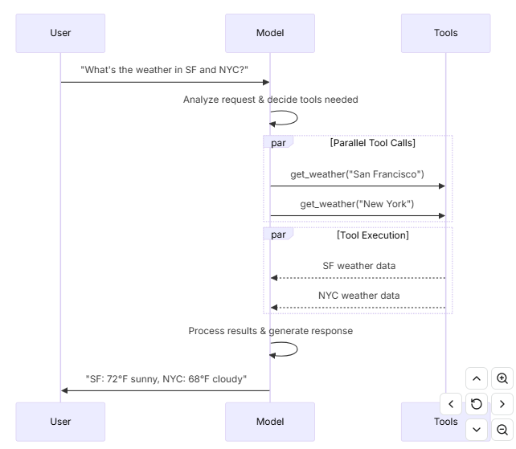

# 1. 初始化模型

`pip install -U "langchain[openai]"`

`pip install -U "langchain[anthropic]"`

`pip install -U "langchain[google-genai]"`

```python
import os
from langchain.chat_models import init_chat_model

os.environ["OPENAI_API_KEY"] = "sk-..."

model = init_chat_model("gpt-4.1")

import os
from langchain.chat_models import init_chat_model

os.environ["ANTHROPIC_API_KEY"] = "sk-..."

model = init_chat_model("claude-sonnet-4-5-20250929")

import os
from langchain.chat_models import init_chat_model

os.environ["GOOGLE_API_KEY"] = "..."

model = init_chat_model("google_genai:gemini-2.5-flash-lite")

response = model.invoke("Why do parrots talk?")
```

# 2. 调用

```python
response = model.invoke("Why do parrots have colorful feathers?")
print(response)

conversation = [
    {"role": "system", "content": "You are a helpful assistant that translates English to French."},
    {"role": "user", "content": "Translate: I love programming."},
    {"role": "assistant", "content": "J'adore la programmation."},
    {"role": "user", "content": "Translate: I love building applications."}
]

response = model.invoke(conversation)
print(response)  # AIMessage("J'adore créer des applications.")

from langchain.messages import HumanMessage, AIMessage, SystemMessage

conversation = [
    SystemMessage("You are a helpful assistant that translates English to French."),
    HumanMessage("Translate: I love programming."),
    AIMessage("J'adore la programmation."),
    HumanMessage("Translate: I love building applications.")
]

response = model.invoke(conversation)
print(response)  # AIMessage("J'adore créer des applications.")
```

可以传入一个字符，也可以传入一个messages列表。

# 3. 流

```python
for chunk in model.stream("Why do parrots have colorful feathers?"):
    print(chunk.text, end="|", flush=True)
```

invoke()在模型生成完整响应后返回单个 AIMessage。stream() 返回多个 [`AIMessageChunk`](https://reference.langchain.com/python/langchain/messages/#langchain.messages.AIMessageChunk) 对象，每个对象包含输出文本的一部分。重要的是，流中的每个片段都设计成通过汇总汇集成完整消息：

```python
full = None  # None | AIMessageChunk
for chunk in model.stream("What color is the sky?"):
    full = chunk if full is None else full + chunk
    print(full.text)

# The
# The sky
# The sky is
# The sky is typically
# The sky is typically blue
# ...

print(full.content_blocks)
# [{"type": "text", "text": "The sky is typically blue..."}]
```

# 4. Batch

批量处理一组独立请求到模型可以显著提升性能并降低成本，因为处理可以并行完成：

```python
responses = model.batch([
    "Why do parrots have colorful feathers?",
    "How do airplanes fly?",
    "What is quantum computing?"
])
for response in responses:
    print(response)
```

默认情况下，[`batch（）`](https://reference.langchain.com/python/langchain_core/language_models/#langchain_core.language_models.chat_models.BaseChatModel.batch) 只返回整个批次的最终输出。如果你想在每个输入生成完成时接收输出，可以用 [`batch_as_completed（）`](https://reference.langchain.com/python/langchain_core/language_models/#langchain_core.language_models.chat_models.BaseChatModel.batch_as_completed)流式传输结果：

```python
for response in model.batch_as_completed([
    "Why do parrots have colorful feathers?",
    "How do airplanes fly?",
    "What is quantum computing?"
]):
    print(response)
```

可以控制最大并发数量：

```python
model.batch(
    list_of_inputs,
    config={
        'max_concurrency': 5,  # Limit to 5 parallel calls
    }
)
```

# 5. 工具调用



```python
from langchain.tools import tool

@tool
def get_weather(location: str) -> str:
    """Get the weather at a location."""
    return f"It's sunny in {location}."


model_with_tools = model.bind_tools([get_weather])  

response = model_with_tools.invoke("What's the weather like in Boston?")
for tool_call in response.tool_calls:
    # View tool calls made by the model
    print(f"Tool: {tool_call['name']}")
    print(f"Args: {tool_call['args']}")
```

绑定用户自定义工具时，模型响应包含执行工具的**请求** 。当模型与[智能体](https://docs.langchain.com/oss/python/langchain/agents)分离使用时，你需要执行请求的工具并将结果返回模型以供后续推理使用。使用[代理](https://docs.langchain.com/oss/python/langchain/agents)时，智能体循环会帮你处理工具的执行循环。

## 4.1. 工具循环调用

```python
# Bind (potentially multiple) tools to the model
model_with_tools = model.bind_tools([get_weather])

# Step 1: Model generates tool calls
messages = [{"role": "user", "content": "What's the weather in Boston?"}]
ai_msg = model_with_tools.invoke(messages)
messages.append(ai_msg)

# Step 2: Execute tools and collect results
for tool_call in ai_msg.tool_calls:
    # Execute the tool with the generated arguments
    tool_result = get_weather.invoke(tool_call)
    messages.append(tool_result)

# Step 3: Pass results back to model for final response
final_response = model_with_tools.invoke(messages)
print(final_response.text)
# "The current weather in Boston is 72°F and sunny."
```

## 4.2. 强制工具调用

```python
model_with_tools = model.bind_tools([tool_1], tool_choice="any")
```

## 4.3. 并行工具调用

```python
model_with_tools = model.bind_tools([get_weather])

response = model_with_tools.invoke(
    "What's the weather in Boston and Tokyo?"
)


# The model may generate multiple tool calls
print(response.tool_calls)
# [
#   {'name': 'get_weather', 'args': {'location': 'Boston'}, 'id': 'call_1'},
#   {'name': 'get_weather', 'args': {'location': 'Tokyo'}, 'id': 'call_2'},
# ]


# Execute all tools (can be done in parallel with async)
results = []
for tool_call in response.tool_calls:
    if tool_call['name'] == 'get_weather':
        result = get_weather.invoke(tool_call)
    ...
    results.append(result)
```

大多数支持工具调用的模型默认启用并行工具调用。部分（包括 OpenAI 和 Anthropic）允许你禁用此功能。为此，设置 `parallel_tool_calls=False`：

```python
model.bind_tools([get_weather], parallel_tool_calls=False)
```

## 4.4. 流式工具调用

```python
for chunk in model_with_tools.stream(
    "What's the weather in Boston and Tokyo?"
):
    # Tool call chunks arrive progressively
    for tool_chunk in chunk.tool_call_chunks:
        if name := tool_chunk.get("name"):
            print(f"Tool: {name}")
        if id_ := tool_chunk.get("id"):
            print(f"ID: {id_}")
        if args := tool_chunk.get("args"):
            print(f"Args: {args}")

# Output:
# Tool: get_weather
# ID: call_SvMlU1TVIZugrFLckFE2ceRE
# Args: {"lo
# Args: catio
# Args: n": "B
# Args: osto
# Args: n"}
# Tool: get_weather
# ID: call_QMZdy6qInx13oWKE7KhuhOLR
# Args: {"lo
# Args: catio
# Args: n": "T
# Args: okyo
# Args: "}
```

```python
gathered = None
for chunk in model_with_tools.stream("What's the weather in Boston?"):
    gathered = chunk if gathered is None else gathered + chunk
    print(gathered.tool_calls)
```

# 6. 结构化输出

## 6.1. pydantic

```python
from pydantic import BaseModel, Field

class Movie(BaseModel):
    """A movie with details."""
    title: str = Field(..., description="The title of the movie")
    year: int = Field(..., description="The year the movie was released")
    director: str = Field(..., description="The director of the movie")
    rating: float = Field(..., description="The movie's rating out of 10")

model_with_structure = model.with_structured_output(Movie)
response = model_with_structure.invoke("Provide details about the movie Inception")
print(response)  # Movie(title="Inception", year=2010, director="Christopher Nolan", rating=8.8)
```

## 6.2 typedict

```python
from typing_extensions import TypedDict, Annotated

class MovieDict(TypedDict):
    """A movie with details."""
    title: Annotated[str, ..., "The title of the movie"]
    year: Annotated[int, ..., "The year the movie was released"]
    director: Annotated[str, ..., "The director of the movie"]
    rating: Annotated[float, ..., "The movie's rating out of 10"]

model_with_structure = model.with_structured_output(MovieDict)
response = model_with_structure.invoke("Provide details about the movie Inception")
print(response)  # {'title': 'Inception', 'year': 2010, 'director': 'Christopher Nolan', 'rating': 8.8}
```

## 6.3 json schema

```python
import json

json_schema = {
    "title": "Movie",
    "description": "A movie with details",
    "type": "object",
    "properties": {
        "title": {
            "type": "string",
            "description": "The title of the movie"
        },
        "year": {
            "type": "integer",
            "description": "The year the movie was released"
        },
        "director": {
            "type": "string",
            "description": "The director of the movie"
        },
        "rating": {
            "type": "number",
            "description": "The movie's rating out of 10"
        }
    },
    "required": ["title", "year", "director", "rating"]
}

model_with_structure = model.with_structured_output(
    json_schema,
    method="json_schema",
)
response = model_with_structure.invoke("Provide details about the movie Inception")
print(response)  # {'title': 'Inception', 'year': 2010, ...}
```

- **Method parameter**: Some providers support different methods for structured output:
  - `'json_schema'`: Uses dedicated structured output features offered by the provider.
  - `'function_calling'`: Derives structured output by forcing a [tool call](https://docs.langchain.com/oss/python/langchain/models#tool-calling) that follows the given schema.
  - `'json_mode'`: A precursor to `'json_schema'` offered by some providers. Generates valid JSON, but the schema must be described in the prompt.
- **Include raw**: Set `include_raw=True` to get both the parsed output and the raw AI message.
- **Validation**: Pydantic models provide automatic validation. `TypedDict` and JSON Schema require manual validation.

## 6.4 结构化输出和消息一起返回

```python
from pydantic import BaseModel, Field

class Movie(BaseModel):
    """A movie with details."""
    title: str = Field(..., description="The title of the movie")
    year: int = Field(..., description="The year the movie was released")
    director: str = Field(..., description="The director of the movie")
    rating: float = Field(..., description="The movie's rating out of 10")

model_with_structure = model.with_structured_output(Movie, include_raw=True)  
response = model_with_structure.invoke("Provide details about the movie Inception")
response
# {
#     "raw": AIMessage(...),
#     "parsed": Movie(title=..., year=..., ...),
#     "parsing_error": None,
# }
```

## 6.5 结构化嵌套

```python
from typing_extensions import Annotated, TypedDict

class Actor(TypedDict):
    name: str
    role: str

class MovieDetails(TypedDict):
    title: str
    year: int
    cast: list[Actor]
    genres: list[str]
    budget: Annotated[float | None, ..., "Budget in millions USD"]

model_with_structure = model.with_structured_output(MovieDetails)
```

# 7. 高级用法

## 7.1 使用自定义的模型

```python
model = init_chat_model(
    model="MODEL_NAME",
    model_provider="openai",
    base_url="BASE_URL",
    api_key="YOUR_API_KEY",
)
```

## 7.2. 设置请求速率

```python
from langchain_core.rate_limiters import InMemoryRateLimiter

rate_limiter = InMemoryRateLimiter(
    requests_per_second=0.1,  # 1 request every 10s
    check_every_n_seconds=0.1,  # Check every 100ms whether allowed to make a request
    max_bucket_size=10,  # Controls the maximum burst size.
)

model = init_chat_model(
    model="gpt-5",
    model_provider="openai",
    rate_limiter=rate_limiter  
)
```

## 7.3. 计算token的使用

```python
from langchain.chat_models import init_chat_model
from langchain_core.callbacks import UsageMetadataCallbackHandler

model_1 = init_chat_model(model="gpt-4o-mini")
model_2 = init_chat_model(model="claude-haiku-4-5-20251001")

callback = UsageMetadataCallbackHandler()
result_1 = model_1.invoke("Hello", config={"callbacks": [callback]})
result_2 = model_2.invoke("Hello", config={"callbacks": [callback]})
callback.usage_metadata

# 或者

from langchain.chat_models import init_chat_model
from langchain_core.callbacks import get_usage_metadata_callback

model_1 = init_chat_model(model="gpt-4o-mini")
model_2 = init_chat_model(model="claude-haiku-4-5-20251001")

with get_usage_metadata_callback() as cb:
    model_1.invoke("Hello")
    model_2.invoke("Hello")
    print(cb.usage_metadata)
```

## 7.4. 设置调用参数

```python
response = model.invoke(
    "Tell me a joke",
    config={
        "run_name": "joke_generation",      # Custom name for this run
        "tags": ["humor", "demo"],          # Tags for categorization
        "metadata": {"user_id": "123"},     # Custom metadata
        "callbacks": [my_callback_handler], # Callback handlers
    }
)
```

## 7.5 设置可配置的模型

```python
from langchain.chat_models import init_chat_model

configurable_model = init_chat_model(temperature=0)

configurable_model.invoke(
    "what's your name",
    config={"configurable": {"model": "gpt-5-nano"}},  # Run with GPT-5-Nano
)
configurable_model.invoke(
    "what's your name",
    config={"configurable": {"model": "claude-sonnet-4-5-20250929"}},  # Run with Claude
)

# 或者
first_model = init_chat_model(
        model="gpt-4.1-mini",
        temperature=0,
        configurable_fields=("model", "model_provider", "temperature", "max_tokens"),
        config_prefix="first",  # Useful when you have a chain with multiple models
)

first_model.invoke("what's your name")

first_model.invoke(
    "what's your name",
    config={
        "configurable": {
            "first_model": "claude-sonnet-4-5-20250929",
            "first_temperature": 0.5,
            "first_max_tokens": 100,
        }
    },
)

# 或者
from pydantic import BaseModel, Field


class GetWeather(BaseModel):
    """Get the current weather in a given location"""

        location: str = Field(..., description="The city and state, e.g. San Francisco, CA")


class GetPopulation(BaseModel):
    """Get the current population in a given location"""

        location: str = Field(..., description="The city and state, e.g. San Francisco, CA")


model = init_chat_model(temperature=0)
model_with_tools = model.bind_tools([GetWeather, GetPopulation])

model_with_tools.invoke(
    "what's bigger in 2024 LA or NYC", config={"configurable": {"model": "gpt-4.1-mini"}}
).tool_calls
```


