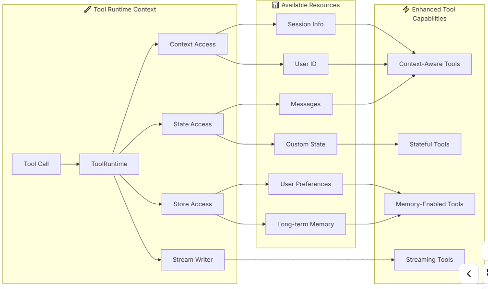

# 1. 创建工具

## 1.1. 工具的基本定义

```python
from langchain.tools import tool

@tool
def search_database(query: str, limit: int = 10) -> str:
    """Search the customer database for records matching the query.

    Args:
        query: Search terms to look for
        limit: Maximum number of results to return
    """
    return f"Found {limit} results for '{query}'"
```

## 1.2. 自定义工具属性

### 1.2.1. 自定义工具名称

```python
@tool("web_search")  # Custom name
def search(query: str) -> str:
    """Search the web for information."""
    return f"Results for: {query}"

print(search.name)  # web_search
```

### 1.2.2. 自定义工具描述

```python
@tool("calculator", description="Performs arithmetic calculations. Use this for any math problems.")
def calc(expression: str) -> str:
    """Evaluate mathematical expressions."""
    return str(eval(expression))
```

### 1.2.3. 高级模式定义

pydantic定义：

```python
from pydantic import BaseModel, Field
from typing import Literal

class WeatherInput(BaseModel):
    """Input for weather queries."""
    location: str = Field(description="City name or coordinates")
    units: Literal["celsius", "fahrenheit"] = Field(
        default="celsius",
        description="Temperature unit preference"
    )
    include_forecast: bool = Field(
        default=False,
        description="Include 5-day forecast"
    )

@tool(args_schema=WeatherInput)
def get_weather(location: str, units: str = "celsius", include_forecast: bool = False) -> str:
    """Get current weather and optional forecast."""
    temp = 22 if units == "celsius" else 72
    result = f"Current weather in {location}: {temp} degrees {units[0].upper()}"
    if include_forecast:
        result += "\nNext 5 days: Sunny"
    return result
```

json格式定义：

```python
weather_schema = {
    "type": "object",
    "properties": {
        "location": {"type": "string"},
        "units": {"type": "string"},
        "include_forecast": {"type": "boolean"}
    },
    "required": ["location", "units", "include_forecast"]
}

@tool(args_schema=weather_schema)
def get_weather(location: str, units: str = "celsius", include_forecast: bool = False) -> str:
    """Get current weather and optional forecast."""
    temp = 22 if units == "celsius" else 72
    result = f"Current weather in {location}: {temp} degrees {units[0].upper()}"
    if include_forecast:
        result += "\nNext 5 days: Sunny"
    return result
```

# 2. 访问上下文



工具可以通过 `ToolRuntime` 参数访问运行时信息，该参数提供：

- **State** - Mutable data that flows through execution (e.g., messages, counters, custom fields)
- **Context** - Immutable configuration like user IDs, session details, or application-specific configuration
- **Store** - Persistent long-term memory across conversations
- **Stream Writer** - Stream custom updates as tools execute
- **Config** - `RunnableConfig` for the execution
- **Tool Call ID** - ID of the current tool call

## 2.1. 访问状态

```python
from langchain.tools import tool, ToolRuntime

# Access the current conversation state
@tool
def summarize_conversation(
    runtime: ToolRuntime
) -> str:
    """Summarize the conversation so far."""
    messages = runtime.state["messages"]

    human_msgs = sum(1 for m in messages if m.__class__.__name__ == "HumanMessage")
    ai_msgs = sum(1 for m in messages if m.__class__.__name__ == "AIMessage")
    tool_msgs = sum(1 for m in messages if m.__class__.__name__ == "ToolMessage")

    return f"Conversation has {human_msgs} user messages, {ai_msgs} AI responses, and {tool_msgs} tool results"

# Access custom state fields
@tool
def get_user_preference(
    pref_name: str,
    runtime: ToolRuntime  # ToolRuntime parameter is not visible to the model
) -> str:
    """Get a user preference value."""
    preferences = runtime.state.get("user_preferences", {})
    return preferences.get(pref_name, "Not set")
```

## 2.2. 更新状态

```python
from langgraph.types import Command
from langchain.messages import RemoveMessage
from langgraph.graph.message import REMOVE_ALL_MESSAGES
from langchain.tools import tool, ToolRuntime

# Update the conversation history by removing all messages
@tool
def clear_conversation() -> Command:
    """Clear the conversation history."""

    return Command(
        update={
            "messages": [RemoveMessage(id=REMOVE_ALL_MESSAGES)],
        }
    )

# Update the user_name in the agent state
@tool
def update_user_name(
    new_name: str,
    runtime: ToolRuntime
) -> Command:
    """Update the user's name."""
    return Command(update={"user_name": new_name})
```

## 2.3. 上下文

工具可以通过 `ToolRuntime` 访问运行时上下文：

```python
from dataclasses import dataclass
from langchain_openai import ChatOpenAI
from langchain.agents import create_agent
from langchain.tools import tool, ToolRuntime


USER_DATABASE = {
    "user123": {
        "name": "Alice Johnson",
        "account_type": "Premium",
        "balance": 5000,
        "email": "alice@example.com"
    },
    "user456": {
        "name": "Bob Smith",
        "account_type": "Standard",
        "balance": 1200,
        "email": "bob@example.com"
    }
}

@dataclass
class UserContext:
    user_id: str

@tool
def get_account_info(runtime: ToolRuntime[UserContext]) -> str:
    """Get the current user's account information."""
    user_id = runtime.context.user_id

    if user_id in USER_DATABASE:
        user = USER_DATABASE[user_id]
        return f"Account holder: {user['name']}\nType: {user['account_type']}\nBalance: ${user['balance']}"
    return "User not found"

model = ChatOpenAI(model="gpt-4o")
agent = create_agent(
    model,
    tools=[get_account_info],
    context_schema=UserContext,
    system_prompt="You are a financial assistant."
)

result = agent.invoke(
    {"messages": [{"role": "user", "content": "What's my current balance?"}]},
    context=UserContext(user_id="user123")
)
```

## 2.4. 记忆存储

```python
from typing import Any
from langgraph.store.memory import InMemoryStore
from langchain.agents import create_agent
from langchain.tools import tool, ToolRuntime


# Access memory
@tool
def get_user_info(user_id: str, runtime: ToolRuntime) -> str:
    """Look up user info."""
    store = runtime.store
    user_info = store.get(("users",), user_id)
    return str(user_info.value) if user_info else "Unknown user"

# Update memory
@tool
def save_user_info(user_id: str, user_info: dict[str, Any], runtime: ToolRuntime) -> str:
    """Save user info."""
    store = runtime.store
    store.put(("users",), user_id, user_info)
    return "Successfully saved user info."

store = InMemoryStore()
agent = create_agent(
    model,
    tools=[get_user_info, save_user_info],
    store=store
)

# First session: save user info
agent.invoke({
    "messages": [{"role": "user", "content": "Save the following user: userid: abc123, name: Foo, age: 25, email: foo@langchain.dev"}]
})

# Second session: get user info
agent.invoke({
    "messages": [{"role": "user", "content": "Get user info for user with id 'abc123'"}]
})
# Here is the user info for user with ID "abc123":
# - Name: Foo
# - Age: 25
# - Email: foo@langchain.dev
```

这个有什么用呢，可以将一些持久化的信息保存到store里面，然后需要用的时候可以从store中获取。

## 2.5. stream writer

在工具执行时实时流式传输自定义更新 `runtime.stream_writer`。这有助于向用户实时反馈工具的工作表现。

```python
from langchain.tools import tool, ToolRuntime

@tool
def get_weather(city: str, runtime: ToolRuntime) -> str:
    """Get weather for a given city."""
    writer = runtime.stream_writer

    # Stream custom updates as the tool executes
    writer(f"Looking up data for city: {city}")
    writer(f"Acquired data for city: {city}")

    return f"It's always sunny in {city}!"
```

如果你在工具中使用 `runtime.stream_writer`，必须在 LangGraph 执行上下文中调用该工具。