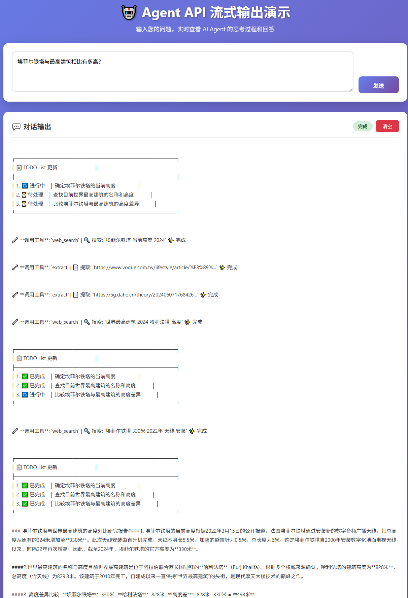

# 说明

安装基础环境：
```shell
pip install deepagents tavily-python
pip install fastmcp
pip install tavily
pip install langchain-mcp-adapters

Successfully installed anthropic-0.76.0 bracex-2.6 deepagents-0.3.7 filetype-1.2.0 google-auth-2.47.0 google-genai-1.60.0 jsonpatch-1.33 jsonpointer-3.0.0 langchain-1.2.6 langchain-anthropic-1.3.1 langchain-core-1.2.7 langchain-google-genai-4.2.0 langgraph-1.0.6 langgraph-checkpoint-4.0.0 langgraph-prebuilt-1.0.6 langgraph-sdk-0.3.3 langsmith-0.6.4 ormsgpack-1.12.2 pyasn1-0.6.2 pyasn1-modules-0.4.2 requests-toolbelt-1.0.0 rsa-4.9.1 tavily-python-0.7.19 uuid-utils-0.14.0 wcmatch-10.1 fastmcp-2.14.3 tavily-1.0.0 langchain-mcp-adapters-0.2.1

```

使用deepagents结合mcp，构建一个能够自己搜索的智能体。

deepagents地址：https://github.com/langchain-ai/deepagents

支持以下参数：
```python
create_deep_agent(
    model: str | BaseChatModel | None = None,
    tools: Sequence[BaseTool | Callable | dict[str, Any]] | None = None,
    *,
    system_prompt: str | SystemMessage | None = None,
    middleware: Sequence[AgentMiddleware] = (),
    subagents: list[SubAgent | CompiledSubAgent] | None = None,
    skills: list[str] | None = None,
    memory: list[str] | None = None,
    response_format: ResponseFormat | None = None,
    context_schema: type[Any] | None = None,
    checkpointer: Checkpointer | None = None,
    store: BaseStore | None = None,
    backend: BackendProtocol | BackendFactory | None = None,
    interrupt_on: dict[str, bool | InterruptOnConfig] | None = None,
    debug: bool = False,
    name: str | None = None,
    cache: BaseCache | None = None,
) -> CompiledStateGraph
```
其余函数的输入参数可以参考这里：https://reference.langchain.com/python/deepagents/

目录说明：

```shell
deepagents_with_mcp/
├── 📄 agent.py                          # 主程序：使用中间件和MCP的Agent示例，展示如何集成TodoList和TextToolCalls中间件
├── 📄 agent_api.py                      # FastAPI服务器：提供OpenAI格式的聊天API接口，支持流式输出
├── 📄 text_tool_calls_middleware.py    # 自定义中间件：解析文本格式的工具调用并转换为结构化工具调用
├── 📄 simplified_todolist_middleware.py # 简化版TodoList中间件：减少系统提示词长度的任务规划中间件
├── 📄 test_mcp.py                      # 测试脚本：测试MCP服务器连接和工具调用功能
├── 📄 test_stream.py                   # 测试脚本：测试流式API的客户端
├── 📄 build_travily_mcp.py             # MCP服务器：构建基于Tavily的Web搜索MCP服务器
├── 📄 web_demo.html                    # Web演示页面：前端界面
│
├── 📁 langchain/                       # LangChain框架核心代码
│   ├── 📁 agents/                      # Agent相关模块
│   │   ├── 📁 middleware/              # Agent中间件集合
│   │   │   ├── todo.py                 # TodoList中间件：任务规划和进度跟踪
│   │   │   ├── tool_retry.py           # 工具重试中间件
│   │   │   ├── tool_emulator.py        # 工具模拟中间件
│   │   │   ├── tool_call_limit.py      # 工具调用限制中间件
│   │   │   ├── summarization.py        # 摘要中间件
│   │   │   ├── file_search.py          # 文件搜索中间件
│   │   │   ├── model_retry.py          # 模型重试中间件
│   │   │   ├── model_fallback.py       # 模型回退中间件
│   │   │   ├── model_call_limit.py     # 模型调用限制中间件
│   │   │   ├── human_in_the_loop.py    # 人工审核中间件
│   │   │   ├── pii.py                  # PII数据保护中间件
│   │   │   ├── shell_tool.py           # Shell工具中间件
│   │   │   ├── context_editing.py      # 上下文编辑中间件
│   │   │   ├── _retry.py               # 重试工具
│   │   │   ├── _redaction.py           # 数据脱敏工具
│   │   │   ├── _execution.py           # 执行工具
│   │   │   ├── tool_selection.py       # 工具选择中间件
│   │   │   └── types.py                # 中间件类型定义
│   │   ├── factory.py                  # Agent工厂函数
│   │   ├── structured_output.py        # 结构化输出
│   │   └── __init__.py
│   ├── 📁 chat_models/                 # 聊天模型模块
│   │   ├── base.py                     # 基础聊天模型
│   │   └── __init__.py
│   ├── 📁 tools/                       # 工具模块
│   │   ├── tool_node.py                # 工具节点
│   │   └── __init__.py
│   ├── 📁 messages/                    # 消息模块
│   ├── 📁 embeddings/                  # 嵌入模块
│   ├── 📁 rate_limiters/               # 速率限制器
│   ├── __init__.py
│   └── py.typed
│
├── 📁 deepagents/                      # DeepAgents框架代码
│   ├── 📁 middleware/                  # DeepAgents中间件
│   │   ├── summarization.py            # 摘要中间件
│   │   ├── subagents.py                # 子Agent中间件
│   │   ├── skills.py                   # 技能中间件
│   │   ├── patch_tool_calls.py         # 工具调用补丁
│   │   ├── memory.py                   # 记忆中间件
│   │   ├── filesystem.py               # 文件系统中间件
│   │   ├── _utils.py                   # 工具函数
│   │   └── __init__.py
│   ├── 📁 backends/                    # 后端实现
│   │   ├── utils.py                    # 后端工具
│   │   ├── store.py                    # 存储后端
│   │   ├── state.py                    # 状态后端
│   │   ├── sandbox.py                  # 沙箱后端
│   │   ├── protocol.py                 # 协议定义
│   │   ├── filesystem.py               # 文件系统后端
│   │   ├── composite.py                # 组合后端
│   │   └── __init__.py
│   ├── graph.py                        # 图定义
│   └── __init__.py
│
└── 📁 langgraph/                       # LangGraph框架代码
    ├── 📁 pregel/                      # Pregel算法实现
    │   ├── main.py                     # 主入口
    │   ├── _algo.py                    # 算法核心
    │   ├── _runner.py                  # 运行器
    │   ├── _executor.py                # 执行器
    │   ├── _loop.py                    # 循环控制
    │   ├── _call.py                    # 调用处理
    │   ├── _read.py                    # 读取处理
    │   ├── _write.py                   # 写入处理
    │   ├── _retry.py                   # 重试处理
    │   ├── _config.py                  # 配置
    │   ├── _checkpoint.py              # 检查点
    │   ├── _messages.py                # 消息处理
    │   ├── _log.py                     # 日志
    │   ├── _io.py                      # IO处理
    │   ├── _validate.py                # 验证
    │   ├── _utils.py                   # 工具函数
    │   ├── _draw.py                    # 绘图
    │   ├── debug.py                    # 调试
    │   ├── protocol.py                 # 协议
    │   ├── remote.py                   # 远程
    │   ├── types.py                    # 类型定义
    │   └── __init__.py
    ├── 📁 prebuilt/                    # 预构建组件
    │   ├── chat_agent_executor.py      # 聊天Agent执行器
    │   ├── tool_node.py                # 工具节点
    │   ├── tool_validator.py           # 工具验证器
    │   ├── interrupt.py                # 中断处理
    │   └── __init__.py
    ├── 📁 checkpoint/                  # 检查点系统
    │   └── 📁 serde/                   # 序列化
    │       ├── base.py                 # 基础序列化
    │       ├── jsonplus.py             # JSON+序列化
    │       ├── encrypted.py            # 加密序列化
    │       ├── types.py                # 类型定义
    │       └── __init__.py
    ├── 📁 channels/                    # 通道系统
    │   ├── base.py                     # 基础通道
    │   ├── any_value.py                # 任意值通道
    │   ├── last_value.py               # 最后值通道
    │   ├── binop.py                    # 二元操作通道
    │   ├── ephemeral_value.py          # 临时值通道
    │   ├── topic.py                    # 主题通道
    │   ├── named_barrier_value.py      # 命名屏障通道
    │   ├── untracked_value.py          # 非跟踪值通道
    │   └── __init__.py
    ├── 📁 managed/                     # 托管状态
    │   ├── base.py                     # 基础托管
    │   ├── is_last_step.py             # 最后步骤判断
    │   └── __init__.py
    ├── 📁 _internal/                   # 内部模块
    │   ├── _cache.py                   # 缓存
    │   ├── _config.py                  # 配置
    │   ├── _constants.py               # 常量
    │   ├── _fields.py                  # 字段
    │   ├── _future.py                  # Future
    │   ├── _pydantic.py                # Pydantic集成
    │   ├── _queue.py                   # 队列
    │   ├── _retry.py                   # 重试
    │   ├── _runnable.py                # Runnable
    │   ├── _scratchpad.py              # 草稿板
    │   ├── _typing.py                  # 类型
    │   └── __init__.py
    ├── 📁 store/                       # 存储系统
    │   └── 📁 memory/                   # 内存存储
    ├── 📁 cache/                       # 缓存系统
    │   └── 📁 memory/                   # 内存缓存
    ├── 📁 utils/                       # 工具模块
    │   ├── runnable.py                 # Runnable工具
    │   ├── config.py                   # 配置工具
    │   └── __init__.py
    ├── graph.py                        # 图定义
    ├── runtime.py                      # 运行时
    ├── config.py                       # 配置
    ├── types.py                        # 类型
    ├── constants.py                    # 常量
    ├── errors.py                       # 错误
    ├── warnings.py                     # 警告
    ├── version.py                      # 版本
    ├── typing.py                       # 类型
    ├── py.typed
    └── __init__.py
```

## 部署模型

我们可以使用外部的大模型，也可以自己部署，这里我们自己部署一个Qwen3-30B-A3B的模型用作实验。
```shell
CUDA_VISIBLE_DEVICES=0 vllm serve Qwen/Qwen3-30B-A3B-Instruct-2507--host 0.0.0.0 --port 18000 --tensor-parallel-size 1 --gpu-memory-utilization 0.95 --max-model-len 16000 --enable-auto-tool-choice --tool-call-parser pythonic
```

## 构建一个tavily的mcp服务
注册并申请一个api key：https://app.tavily.com/home 

langchain中如何使用可以参考这里： https://docs.tavily.com/documentation/integrations/langchain

travily的接口文档参考这里：https://docs.tavily.com/documentation/api-reference/endpoint/search

我们可以使用langchain内置的travily工具，也可以自己用fastmcp来封装一个mcp，为了能够让以后我们能够自定义各种mcp，我们这里自定义一个travli mcp：
```python
from mcp.server.fastmcp import FastMCP
from typing import Literal
from tavily import TavilyClient

mcp = FastMCP("Web-Search-Server")

tavily_client = TavilyClient(api_key="tvly-xxxx") ## 修改为你的key


@mcp.tool()
def web_search(query: str, max_results: int = 5,
               topic: Literal["general", "news", "finance"] = "general",
               include_raw_content: bool = False):
    """Run a web search"""
    return tavily_client.search(
        query,
        max_results=max_results,
        include_raw_content=include_raw_content,
        topic=topic,
    )
    
@mcp.tool()
def extract(url: str):
    """Extract web page content from URL."""
    return tavily_client.extract(url)

if __name__ == "__main__":
    mcp.settings.port = 6030
    mcp.run("sse")
```
## 自定义模型
结合上面我们启动的服务，我们可以自定义一个模型，参考代码如下：
```python
model = init_chat_model(
    model="/nfs/FM/gongoubo/checkpoints/Qwen/Qwen3-30B-A3B-Instruct-2507",
    model_provider="openai",
    base_url="http://localhost:16000/v1",
    api_key="none",
)
```

## 解析工具
由于我们部署模型的时候指定了工具调用的格式为pythonic，langchain的智能体不会会自动执行该工具（会生成调用工具的结果），具体表现是模型输出调用工具的文本，而在openai返回的结果中，tool_calls是空的，因此不会自动执行该工具。我们需要构建一个中间件，该中间件用于解析文本，并将其结果赋值给tool_calls，并用AIMessage来包装。

## 流式输出
流式输出这里我们使用的是astream_events，这个之前在流式组件学习的时候好像没有见到。在调用这个时，我们可以选择从中间件里面打印不同阶段的信息，从而控制流式输出哪些信息。

## 客户端调用
将agent分装为fastapi（可使用openai格式调用），然后构建了一个简单的可视化页面来调用该api。

启动服务端：`python agent_apt.py`

访问：http://192.168.16.24:8080/web_demo.html



会流式输出相关的tolist、相关工具的调用信息、llm的总结。

# 代码参考

部分代码参考：

> https://mp.weixin.qq.com/s/F4dDJIe_Qj-yJD8WDogHEQ