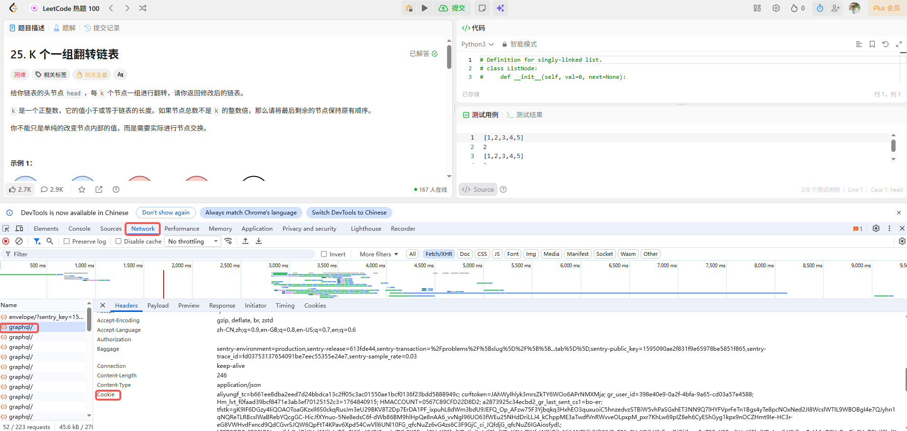
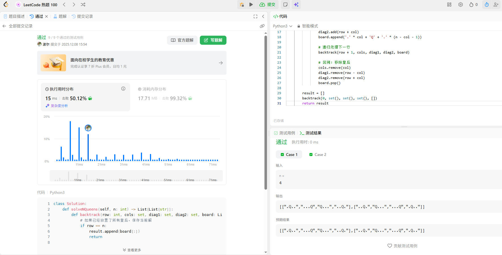

# 说明

准备环境：`cd PocketFlow && pip install -e .`

使用pockflow构造一个能够自己解决Leetcode的智能体，使用的一般步骤：

1. 首先需要登录leetcode的官网，登录后按键盘上的F12，打开开发者工具，



找到对应的cookie以及x-csrftoken，填充到Leetcode_Agent/utils/leetcode_scraper.py里面。

2. 找一个openai格式的LLM接口，可以是自己部署的，也可以是外部的API，修改Leetcode_Agent/utils/llm_client.py，这里我是自己部署的，需要填入base_url。
3. 在leetcode上找到某题目的url，填入到flow.py中即可，比如我们选择leetcode中的https://leetcode.cn/problems/n-queens/，在pocketflow-leetcode目录下运行`python3 -m Leetcode_Agent.flow`运行日志会保存在logs下，以下是该题的结果：

```shell
2025-12-08 07:51:29,111 - leetcode_flow - INFO - /nfs/FM/gongoubo/new_project/Agent-Handbook/pocketflow-leetcode/Leetcode_Agent/flow.py:26 - create_leetcode_flow() - Creating LeetCode workflow
2025-12-08 07:51:30,839 - leetcode_flow - INFO - /nfs/FM/gongoubo/new_project/Agent-Handbook/pocketflow-leetcode/Leetcode_Agent/nodes/user_input_node.py:43 - prep() - leetcode_url：https://leetcode.cn/problems/n-queens/
2025-12-08 07:51:30,839 - leetcode_flow - INFO - /nfs/FM/gongoubo/new_project/Agent-Handbook/pocketflow-leetcode/Leetcode_Agent/nodes/user_input_node.py:44 - prep() - language_preference:python3
2025-12-08 07:51:30,839 - leetcode_flow - INFO - /nfs/FM/gongoubo/new_project/Agent-Handbook/pocketflow-leetcode/Leetcode_Agent/nodes/user_input_node.py:45 - prep() - max_iterations:5
2025-12-08 07:51:32,134 - leetcode_flow - INFO - /nfs/FM/gongoubo/new_project/Agent-Handbook/pocketflow-leetcode/Leetcode_Agent/nodes/user_input_node.py:70 - exec() - 题目标题：n-queens
2025-12-08 07:51:32,134 - leetcode_flow - INFO - /nfs/FM/gongoubo/new_project/Agent-Handbook/pocketflow-leetcode/Leetcode_Agent/nodes/user_input_node.py:71 - exec() - 题目描述：The n-queens puzzle is the problem of placing n queens on an n x n chessboard such that no two queens attack each other.
Given an integer n, return all distinct solutions to the n-queens puzzle. You may return the answer in any order.
Each solution contains a distinct board configuration of the n-queens' placement, where 'Q' and '.' both indicate a queen and an empty space, respectively.
 
Example 1:


Input: n = 4
Output: [[".Q..","...Q","Q...","..Q."],["..Q.","Q...","...Q",".Q.."]]
Explanation: There exist two distinct solutions to the 4-queens puzzle as shown above

Example 2:

Input: n = 1
Output: [["Q"]]

 
Constraints:

1 <= n <= 9


2025-12-08 07:51:32,134 - leetcode_flow - INFO - /nfs/FM/gongoubo/new_project/Agent-Handbook/pocketflow-leetcode/Leetcode_Agent/nodes/user_input_node.py:72 - exec() - 函数描述：class Solution:
    def solveNQueens(self, n: int) -> List[List[str]]:
        
2025-12-08 07:51:32,136 - leetcode_flow - INFO - /nfs/FM/gongoubo/new_project/Agent-Handbook/pocketflow-leetcode/Leetcode_Agent/nodes/parse_problem_node.py:109 - _parse_direct_description() - 代码解题师使用的prompt: 你是一个leetcode解题家，请一步步分析leetcode问题

要求：
1. 需要的时间复杂度和空间复杂度是什么？应该怎么达到？
2. 按照题目要求进行答案的补全，并遍历每一个样例进行测试，你只需要写全测试代码即可，我会自行测试。
3. 测试代码和解题代码要在一个```python3下面。
4. 测试样例用题目中给的即可。

特别注意：请注意补全函数签名里面没有导入的包，避免我运行python程序报错。

输出：
1. 将实现的代码用```python3的markdown格式进行包裹。

LeetCode问题：
The n-queens puzzle is the problem of placing n queens on an n x n chessboard such that no two queens attack each other.
Given an integer n, return all distinct solutions to the n-queens puzzle. You may return the answer in any order.
Each solution contains a distinct board configuration of the n-queens' placement, where 'Q' and '.' both indicate a queen and an empty space, respectively.
 
Example 1:


Input: n = 4
Output: [[".Q..","...Q","Q...","..Q."],["..Q.","Q...","...Q",".Q.."]]
Explanation: There exist two distinct solutions to the 4-queens puzzle as shown above

Example 2:

Input: n = 1
Output: [["Q"]]

 
Constraints:

1 <= n <= 9


函数签名：
class Solution:
    def solveNQueens(self, n: int) -> List[List[str]]:
        

2025-12-08 07:51:38,487 - leetcode_flow - INFO - /nfs/FM/gongoubo/new_project/Agent-Handbook/pocketflow-leetcode/Leetcode_Agent/nodes/parse_problem_node.py:117 - _parse_direct_description() - 代码：from typing import List

class Solution:
    def solveNQueens(self, n: int) -> List[List[str]]:
        def backtrack(row: int, cols: set, diag1: set, diag2: set, board: List[str]):
            # 如果已经放置了所有皇后，保存当前解
            if row == n:
                result.append(board[:])
                return
            
            for col in range(n):
                # 检查当前列、主对角线、副对角线是否已经有皇后
                if col in cols or (row - col) in diag1 or (row + col) in diag2:
                    continue
                
                # 放置皇后
                cols.add(col)
                diag1.add(row - col)
                diag2.add(row + col)
                board.append('.' * col + 'Q' + '.' * (n - col - 1))
                
                # 递归处理下一行
                backtrack(row + 1, cols, diag1, diag2, board)
                
                # 回溯：移除皇后
                cols.remove(col)
                diag1.remove(row - col)
                diag2.remove(row + col)
                board.pop()
        
        result = []
        backtrack(0, set(), set(), set(), [])
        return result

# 测试代码
if __name__ == "__main__":
    solution = Solution()
    
    # 测试用例 1
    n1 = 4
    expected1 = [[".Q..","...Q","Q...","..Q."],["..Q.","Q...","...Q",".Q.."]]
    output1 = solution.solveNQueens(n1)
    print("Test 1 - Input:", n1)
    print("Output:", output1)
    print("Expected:", expected1)
    print("Pass:", sorted(output1) == sorted(expected1))
    print()
    
    # 测试用例 2
    n2 = 1
    expected2 = [["Q"]]
    output2 = solution.solveNQueens(n2)
    print("Test 2 - Input:", n2)
    print("Output:", output2)
    print("Expected:", expected2)
    print("Pass:", output2 == expected2)
    print()
    
    # 额外测试用例：n = 2（应返回空列表，因为无法放置两个皇后不互相攻击）
    n3 = 2
    expected3 = []
    output3 = solution.solveNQueens(n3)
    print("Test 3 - Input:", n3)
    print("Output:", output3)
    print("Expected:", expected3)
    print("Pass:", output3 == expected3)
    print()
    
    # 额外测试用例：n = 3（同样无解）
    n4 = 3
    expected4 = []
    output4 = solution.solveNQueens(n4)
    print("Test 4 - Input:", n4)
    print("Output:", output4)
    print("Expected:", expected4)
    print("Pass:", output4 == expected4)
    print()
    
    # 额外测试用例：n = 5（有解）
    n5 = 5
    output5 = solution.solveNQueens(n5)
    print("Test 5 - Input:", n5)
    print("Number of solutions:", len(output5))
    print("First solution:", output5[0] if output5 else "None")
2025-12-08 07:51:38,534 - leetcode_flow - INFO - /nfs/FM/gongoubo/new_project/Agent-Handbook/pocketflow-leetcode/Leetcode_Agent/nodes/exec_python3_node.py:83 - exec() - 执行结果：Test 1 - Input: 4
Output: [['.Q..', '...Q', 'Q...', '..Q.'], ['..Q.', 'Q...', '...Q', '.Q..']]
Expected: [['.Q..', '...Q', 'Q...', '..Q.'], ['..Q.', 'Q...', '...Q', '.Q..']]
Pass: True

Test 2 - Input: 1
Output: [['Q']]
Expected: [['Q']]
Pass: True

Test 3 - Input: 2
Output: []
Expected: []
Pass: True

Test 4 - Input: 3
Output: []
Expected: []
Pass: True

Test 5 - Input: 5
Number of solutions: 10
First solution: ['Q....', '..Q..', '....Q', '.Q...', '...Q.']
2025-12-08 07:51:38,536 - leetcode_flow - INFO - /nfs/FM/gongoubo/new_project/Agent-Handbook/pocketflow-leetcode/Leetcode_Agent/nodes/exec_python3_node.py:135 - analyse_result() - 代码分析师使用的prompt: 你是一个leetcode代码分析师，你会对判断leetcode解题家的解题是否正确。

要求：
1. 如果正确，回答是，以\box{是}返回。
2. 如果不是，请说明原因，并进一步给出解题的建议。

题目描述：
The n-queens puzzle is the problem of placing n queens on an n x n chessboard such that no two queens attack each other.
Given an integer n, return all distinct solutions to the n-queens puzzle. You may return the answer in any order.
Each solution contains a distinct board configuration of the n-queens' placement, where 'Q' and '.' both indicate a queen and an empty space, respectively.
 
Example 1:


Input: n = 4
Output: [[".Q..","...Q","Q...","..Q."],["..Q.","Q...","...Q",".Q.."]]
Explanation: There exist two distinct solutions to the 4-queens puzzle as shown above

Example 2:

Input: n = 1
Output: [["Q"]]

 
Constraints:

1 <= n <= 9


解题代码：
from typing import List

class Solution:
    def solveNQueens(self, n: int) -> List[List[str]]:
        def backtrack(row: int, cols: set, diag1: set, diag2: set, board: List[str]):
            # 如果已经放置了所有皇后，保存当前解
            if row == n:
                result.append(board[:])
                return
            
            for col in range(n):
                # 检查当前列、主对角线、副对角线是否已经有皇后
                if col in cols or (row - col) in diag1 or (row + col) in diag2:
                    continue
                
                # 放置皇后
                cols.add(col)
                diag1.add(row - col)
                diag2.add(row + col)
                board.append('.' * col + 'Q' + '.' * (n - col - 1))
                
                # 递归处理下一行
                backtrack(row + 1, cols, diag1, diag2, board)
                
                # 回溯：移除皇后
                cols.remove(col)
                diag1.remove(row - col)
                diag2.remove(row + col)
                board.pop()
        
        result = []
        backtrack(0, set(), set(), set(), [])
        return result

# 测试代码
if __name__ == "__main__":
    solution = Solution()
    
    # 测试用例 1
    n1 = 4
    expected1 = [[".Q..","...Q","Q...","..Q."],["..Q.","Q...","...Q",".Q.."]]
    output1 = solution.solveNQueens(n1)
    print("Test 1 - Input:", n1)
    print("Output:", output1)
    print("Expected:", expected1)
    print("Pass:", sorted(output1) == sorted(expected1))
    print()
    
    # 测试用例 2
    n2 = 1
    expected2 = [["Q"]]
    output2 = solution.solveNQueens(n2)
    print("Test 2 - Input:", n2)
    print("Output:", output2)
    print("Expected:", expected2)
    print("Pass:", output2 == expected2)
    print()
    
    # 额外测试用例：n = 2（应返回空列表，因为无法放置两个皇后不互相攻击）
    n3 = 2
    expected3 = []
    output3 = solution.solveNQueens(n3)
    print("Test 3 - Input:", n3)
    print("Output:", output3)
    print("Expected:", expected3)
    print("Pass:", output3 == expected3)
    print()
    
    # 额外测试用例：n = 3（同样无解）
    n4 = 3
    expected4 = []
    output4 = solution.solveNQueens(n4)
    print("Test 4 - Input:", n4)
    print("Output:", output4)
    print("Expected:", expected4)
    print("Pass:", output4 == expected4)
    print()
    
    # 额外测试用例：n = 5（有解）
    n5 = 5
    output5 = solution.solveNQueens(n5)
    print("Test 5 - Input:", n5)
    print("Number of solutions:", len(output5))
    print("First solution:", output5[0] if output5 else "None")

运行结果：
Test 1 - Input: 4
Output: [['.Q..', '...Q', 'Q...', '..Q.'], ['..Q.', 'Q...', '...Q', '.Q..']]
Expected: [['.Q..', '...Q', 'Q...', '..Q.'], ['..Q.', 'Q...', '...Q', '.Q..']]
Pass: True

Test 2 - Input: 1
Output: [['Q']]
Expected: [['Q']]
Pass: True

Test 3 - Input: 2
Output: []
Expected: []
Pass: True

Test 4 - Input: 3
Output: []
Expected: []
Pass: True

Test 5 - Input: 5
Number of solutions: 10
First solution: ['Q....', '..Q..', '....Q', '.Q...', '...Q.']
2025-12-08 07:51:38,742 - leetcode_flow - INFO - /nfs/FM/gongoubo/new_project/Agent-Handbook/pocketflow-leetcode/Leetcode_Agent/nodes/exec_python3_node.py:142 - analyse_result() - 代码分析师：\box{是}

```

测试用例基本通过，然后我们将代码复制到leetcode上提交：



完美通过。


# Agent设计思路

## 为什么要设计这个Agent？

之前我们已经通过pocketflow-handbook和pocketflow-adp了解pocketflow的基本使用，以及Agent的相关知识，大多数代码是trae帮我们生成的。现在，我们需要自己动手设计一个Agent，并且自动动手代码实现，进一步加深对Agent的理解。于是，就想到了pcoketflow来实现一个能够自己做题的Agent。

## 整体系统怎么设计

最开始也是直接用trae根据自己的思路来进行初版代码生成，但是，存在以下问题：

- 整体的代码太复杂了，包含大量的验证和异常捕获代码（我们这里主要是为了弄清楚设计原理），不需要这么复杂。
- 整个Agent流程太复杂了，包含太多Agent了，包括问题解析、写代码、测试样例生成、代码执行、结果分析等等。

于是，打算自己从头开始构建，尽量遵循简单的原则。正好最近也在逐步看Anthropic的Agent相关的文章，其中一篇也讲到：

[https://github.com/taishan1994/Agent-Handbook/blob/main/anthropic-article/002.构建有效的智能体.md](https://github.com/taishan1994/Agent-Handbook/blob/main/anthropic-article/002.构建有效的智能体.md)

构建一个智能体，遵循简单的原则，能不复杂就不复杂。后续也会接着讲Anthropic相关文章中中文翻译版本进行更新。

同样的，在**构建有效的智能体**中，也介绍了不同的Agent的设计模式，我们这里选择**评估器-优化器**模式：

> **何时使用此工作流：** 这种工作流程非常适合那些无法预测需要子任务的复杂任务（例如在编码中，需要更改的文件数量以及每个文件的变更性质很可能取决于任务）。虽然拓扑相似，但与并行化的关键区别在于灵活性——子任务不是预先定义的，而是由编排器根据具体输入决定的。

**编排工作者有用的示例：**

- Coding products that make complex changes to multiple files each time. 那些每次对多个文件进行复杂修改的编码产品。
- Search tasks that involve gathering and analyzing information from multiple sources for possible relevant information. 搜索涉及从多个来源收集和分析信息以寻找可能相关信息的任务。


回到我们的自动做题的Agent，我们可以这么设计：

- 初始化的时候，我们有一个leetcode解题家，用于理解题目意思，并生成初步解题代码，以及根据题目描述生成测试样例和测试代码。
- 然后有一个代码执行家，用于提取解题代码并执行解题代码。
- 代码分析家得到解题代码和解题测试结果，分析结果是否正确，如果正确则结束，如果不正确，则分析原因并把原因给到解题家，再进一步生成解题代码，循环反复上述过程。

## 具体编写中遇到的问题？

### 如何获取leetcode题目的相关信息？

网上查了一下有没有leetcode-agent，找到了一个：https://github.com/AHM215/LeetCode-Agent/tree/main/leetcode_apis

里面提供的leetcode调用方法是可用的。我们可以通过提供leetcode的url来获取题目的描述信息，这正是我们需要的。（当然，还有提交代码到leetcode执行的api，这里我们没有使用到）。

### prompt应该怎么设计？

三个智能体的prompt也是随手就写出来了，遵循的原则：

- 开头定义好智能体的角色，并给出一个总体的任务目标。
- 第二步进一步细化执行目标需要的要求，如果是特别需要注意的，可以在要求前面加上**特别注意**。
- 接下来可以选择定义好输出的格式。
- 最后就是将提供不同的初始化信息。

### 怎么提取代码和执行代码？

一个code agnet是自己更够去查找代码、分析代码、生成代码、执行代码进行循环调用的，我们这里比较简单，但是也存在如何提取代码并执行的问题。做法很简单，约定模型的生成代码必须在markdown格式中，即用**\```python\n代码\n\```**进行包裹，然后用正则表达式提取。测试代码由于限定了模型在解题的时候同步生成python测试代码，因此执行该代码即可获得测试结果。执行代码的话是临时生成一个python文件，然后通过子进程执行该python文件，将执行结果保存下来，并删除掉临时文件。

### 怎么进行错误排查？

一个较为复杂的Agent是很难进行错误排查的，必须得有一个日志来记录中间的状态。目前已经有一些工具来自动记录，比如langfuse。之前也有讲怎么将pocketflow和langfuse进行结合，这里我们直接使用logger日志来记录，我们可以记录文件名、方法名、代码行数、中间输出等信息来看我们的Agent到底是怎么进行的，具体直接看代码即可。

### 循环的定义？

我们设置了一个迭代的最大数目，如果到达这个数目还没有正确解题，则会停止程序。同时，我们会通过正则表达式解析代码分析师的结果是否包含`\box{是}`，椰果包含，则说明解题正确，终止循环。

# 后续

该项目是Agent的一个初步的尝试，也包含了很多信息了，但是还缺少其他的知识，比如：

- 如何去管理超长的上下文。
- 怎么并行化处理任务。

等等。后续我们再结合其他的设计模式以及例子，进一步探索Agent的应用前景。